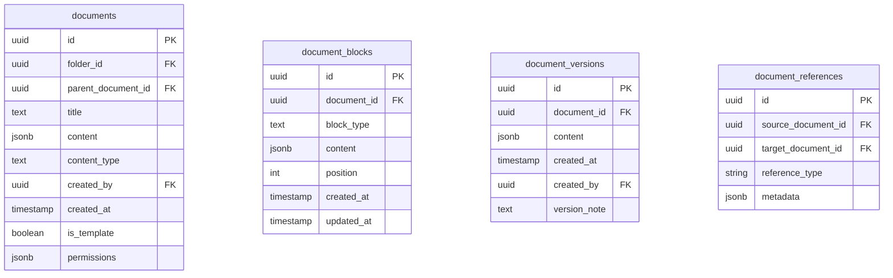

# Implementation Plan for ClickUp-Style Document System

After analyzing the error logs, examining the database schema, and reviewing the codebase, I've developed a comprehensive plan to implement ClickUp-style document features in our application.

## 1. Current State Analysis

### Database Issues Identified
- Error: `column forms.workspace_id does not exist` in FoldersContext.tsx
- Missing database functions: `get_user_email` and `get_user_metadata`
- Current document structure is basic with plain text content

### Current Document System
- Simple title/content model with basic textarea editor
- Documents are organized in folders with no nesting capability
- No rich formatting, versioning, or reference system

## 2. Required Database Schema Updates



## 3. Implementation Phases

### Phase 1: Fix Current Issues
- Remove workspace_id references from forms query
- Create missing database functions
- Update Antd Dropdown components to use menu prop instead of overlay

### Phase 2: Document Structure Enhancements
- Add parent_document_id to documents table
- Update folder menu to show nested document structure
- Modify document creation/editing to support parent-child relationships

### Phase 3: Rich Content Editor
- Change content field from text to JSONB
- Implement block-based editor (using Slate.js or ProseMirror)
- Add block types: headings, paragraphs, lists, code blocks, etc.
- Create document blocks table for structured content storage

### Phase 4: Relations and References
- Implement document reference system
- Add @mention functionality
- Create linking between documents and other workspace elements
- Develop a document reference graph for visualization

### Phase 5: Permissions and Sharing
- Implement document-specific permissions
- Add shared link generation
- Create view-only mode for external users

## 4. Key Components to Develop

### Database
- Update documents table schema
- Create new tables for blocks, references
- Implement database functions for metadata retrieval

### Backend (API)
- Document CRUD with nested structure support
- Block-level operations API
- Reference tracking and resolution
- Permission checking middleware

### Frontend
- Block-based editor component
- Document tree navigator with nesting
- Reference selector and resolver
- Permissions interface
- Sharing management UI

## 5. Technical Approach

1. **Content Storage**:
   ```json
   {
     "blocks": [
       {
         "id": "block-1",
         "type": "heading",
         "level": 1,
         "content": "Document Title"
       },
       {
         "id": "block-2",
         "type": "paragraph",
         "content": "This is a paragraph of text."
       }
     ],
     "version": 1,
     "metadata": {
       "last_edited": "2025-03-21T15:30:00Z"
     }
   }
   ```

2. **Editor Implementation**:
   - Implement using a React-based block editor library
   - Support drag-and-drop reordering of blocks
   - Create toolbar for basic formatting and block insertion
   - Implement content validation before saving

3. **Document Tree**:
   - Modify the current folder menu to display nested documents
   - Develop efficient tree querying for large document sets
   - Implement lazy loading for deeply nested structures

## 6. Migration Strategy

1. Add new fields to documents table without breaking existing functionality
2. Implement dual-mode content handling (support both text and JSON)
3. Create migration script to convert plain text content to structured JSON
4. Roll out UI updates incrementally, with feature flags if needed